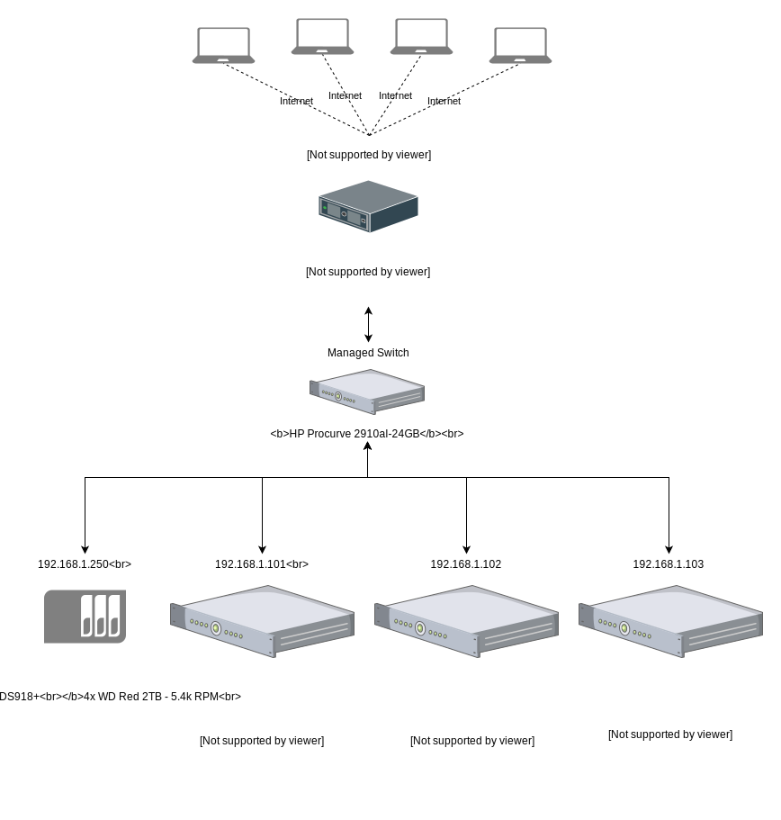
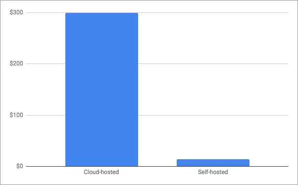
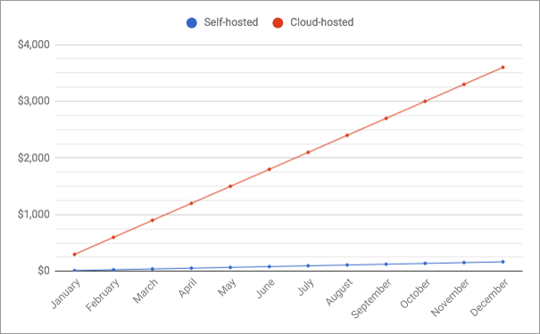

# homelab

> An adapted approach towards managing my personal homelab.

## Why?

A few years ago, I sat back in my chair and wondered if there was a better way to manage my servers. At the time, I had a linode server and was paying something along the lines of several hundred dollars a year -- a cost I thought was acceptable because of my career in software architecture. Being the numbers person I am, I started to price things out to see how much it would cost to build a homelab; I very quickly became obsessed with this idea and spent a lot of time researching the best way to go about everything. I stumbled on [/r/homelab](https://www.reddit.com/r/homelab) shortly after and found my stomping grounds; all sorts of homelab *amazingness* and the best part about it -- other people with similar ideas and a way to communicate with them. From there on out, I spent a lot of time trying to snipe bids on eBay for good homelab contenders. It wasn't long before I had a fully functioning homelab...

Since then, I've shifted my career from software archictecture to cloud architecture and primarily focus on Kubernetes clusters. I got hired at my dream job, [Heptio](https://heptio.com) (which has since been acquired by [VMWare](https://www.vmware.com/)) and have learned an abyss-full of ways to do things in the cloud.

So... This is *my* adapted approach towards managing my own personal homelab.

## Overview

Here is a diagram of what my homelab infrastructure looks like at the moment:

## Costs

### Hardware

Here's a table that indicates what I payed for the hardware in my homelab:

| Item | Price | Info |
|:-----|:-----:|:----:|
| Celeron J1900 | $259.00 | [Amazon](https://www.amazon.com/Firewall-Micro-Appliance-Gigabit-Celeron/dp/B01AJEJG1A/ref=sr_1_2?keywords=the+vault+celeron&qid=1553012352&s=gateway&sr=8-2) |
| HP Procurve 2910al-24GB | $0.00 | Donated to me |
| Synology DS918+ | $549.00 | [Amazon](https://www.amazon.com/Synology-bay-DiskStation-DS918-Diskless/dp/B075N1Z9LT/ref=sr_1_1?crid=1MU0G2O2EJUOU&keywords=synology+ds918%2B&qid=1553012453&s=gateway&sprefix=synology+ds%2Caps%2C151&sr=8-1) |
| 4x WD Red 2TB | $335.96 | [Amazon](https://www.amazon.com/gp/product/B008JJLZ7G/ref=ppx_yo_dt_b_asin_title_o00_s00?ie=UTF8&psc=1) |
| HP Proliant DL380 G6 | ~$300.00 | Ebay (archived) |
| HP Proliant DL380 G7 | ~$325.00 | Ebay (archived) |
| HP Proliant DL360 G6 | ~$285.00 | Ebay (archived) |
| **Subtotal:** | **~$2053.96** | (without tax) |
| **Total:** | **~$2187.47** | (with tax) |

### Hosting

Here's a table that indicates what expenses I pay for to host this homelab (on a monthly basis):

| Item | Price | Info |
|:-----|:-----:|:----:|
| Electricity | $0.00 | ~1.1 kWh on average |
| Cooling | $0.00 | (on battery backup; cooled to ~60°F) |
| Internet | $0.00 | 500MB &darr; 300MB &uarr; (redundant; static IP) |
| Backup Battery | $0.00 | |
| Amazon Route53 | ~$6.25 | Random domains I own |
| Amazon S3 | ~$7.75 | Offsite backups
| **Subtotal:** | **~$13.00** | (without tax) |
| **Total:** | **~$13.84** | (with tax)

Awhile ago, I did work for a customer of mine who agreed to host my servers for me; this has saved me a ton of money and probably the main reason that self-hosting is so cost-friendly (for me). For example, at ~1.1 kWh of electricity and an [FPL](https://www.fpl.com/) kWh rate of $0.065 cents, I'm saving $52.23 a month in just electricity; that's $626.77 a year!

### Cloud-hosted Alternatives

With the hardware listed above, I have the following cloud-relevant compute:

* 1 load balancer
* 430GB RAM
* 36 Cores
* 1.4TB Storage

Here are some links to the various cloud pricings available:

* [Amazon EC2](https://aws.amazon.com/ec2/pricing/on-demand/)
* [Google Compute](https://cloud.google.com/compute/pricing)
* [Azure](https://azure.microsoft.com/en-us/pricing/details/virtual-machines/linux/)
* [Digital Ocean](https://www.digitalocean.com/pricing/)

It's really hard to compare apples-to-apples because cloud providers don't sell similar setups; they are either cpu-focused or memory-focused and no matter how you slice it; you'll be short memory or over on cpus. That said, you can kind of draw the conclusion (from reviewing the pricing sheets), that I'm potentially saving on a few hundred dollars a month.

### Cost Comparisons

#### Monthly

#### Yearly

**Something to note:** My servers originally cost ~$2200; after just 8 months of hosting in the cloud, these servers would have paid for themselves.
