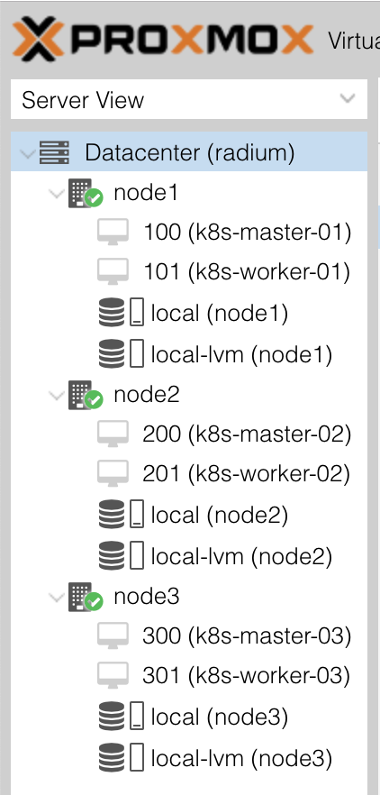

# proxmox-vm-setup

This section will cover mostly everything related to the setup in Proxmox. I chose to document this process because I'm frustrated with the lack of support for infrastructure-as-code for bare-metal clusters in general. [Terraform](https://www.terraform.io/) has pretty good support for `vSphere` and `OpenStack` and some 3rd-party providers custom-written (for example: [https://github.com/Telmate/terraform-provider-proxmox](https://github.com/Telmate/terraform-provider-proxmox)).

## VM Resource Allocation

Proxmox itself has a set of hardware requirements to follow (which can be found [here](https://www.proxmox.com/en/proxmox-ve/requirements)). Below, I've organized the resource utilizations for each node (so I don't exceed quota).

### Node 1

This host has 16 cores, 136GB RAM and 900GB HDD to utilize. Here is a table that indicates how those resources are being split.

| Item | Cores | Memory | HDD |
|:-----|:-----:|:------:|:---:|
| Proxmox | 2 | 4GB | 100GB |
| k8s-master-01 | 4 | 16GB | 100GB |
| k8s-worker-01 | 10 | 116GB | 700GB |

### Node 2

This host has 16 cores, 192GB RAM and 587GB HDD to utilize. Here is a table that indicates how those resources are being split.

| Item | Cores | Memory | HDD |
|:-----|:-----:|:------:|:---:|
| Proxmox | 2 | 4GB | 100GB |
| k8s-master-02 | 4 | 16GB | 100GB |
| k8s-worker-02 | 10 | 172GB | 387GB |

### Node 3

This host has 16 cores, 136GB RAM and 900GB HDD to utilize. Here is a table that indicates how those resources are being split.

| Item | Cores | Memory | HDD |
|:-----|:-----:|:------:|:---:|
| Proxmox | 2 | 4GB | 100GB |
| k8s-master-03 | 4 | 16GB | 100GB |
| k8s-worker-03 | 10 | 116GB | 700GB |

## Setup

### Prerequisites

To proceed with the rest of this "Setup" section, it's recommended that you have a healthy 3+ node Proxmox cluster already installed and configured properly. For more information on how to install proxmox, check the [Get Started](https://www.proxmox.com/en/proxmox-ve/get-started) page on their website.

### Step 1

Pick an operating system distribution of your choice; for this homelab, I chose to run with Ubuntu 18.04 LTS (information on LTS support for Ubuntu can be found [here](https://www.ubuntu.com/about/release-cycle)). To get your VMs up and running, download the `.iso` to your local computer (can be found [here](https://www.ubuntu.com/download/server)). Once downloaded, upload the `.iso` to each node's `local` storage by using the Proxmox Web UI (found at the `https://<proxmox-node-ip>):8006`).

### Step 2

Next, right click on the first node in your proxmox cluster and click `Create VM`. Upon doing so, you'll be presented a wizard to walk you through the very painless steps of creating a VM. Here are some screenshots to show the process:

I'd recommend coming up with a naming schema for your cluster VMs (just to keep yourself organized).

Be sure to select the `.iso` you uploaded in Step 1.

Make sure you change the disk size to the correct amount (as indicated in the resource allocations section above).

A CPU socket is where you'd physically install a CPU chip on a motherboard. With KVM, a socket is only for emulation purposes; whether or not you choose 1 socket and 8 cores or 2 sockets and 4 cores -- it doesn't really matter.

*I typically like to emulate real server combinations when I configure socket/cores.*

In some cases, the number of sockets/cores might affect the software licensing you're installing on the VM; this is probably the only case where it actually matters how you configure sockets/cores.

Make sure you change the memory to the correct amount (as indicated in the resource allocations section above). Remember, this screen asks for the number in `MiB`; to calculate the number, simply multiply the number of `GB` you want by `1024`.

No change is necessary for this step.

This step is just a recap of all the previous steps and a confirmation to move forward with actually creating the VM.

### Step 3

Repeat step 2 for each of the other 5 VMs for this Kubernetes cluster; be sure to refer to the "Resource Allocation" section above when configuring each VM.

When you're done doing so, you're Proxmox side-panel should look something like this:

### Step 4

Make sure that each VM you created will start at boot (when the Proxmox node itself boots). Here is a screenshot that shows where to make the change:

